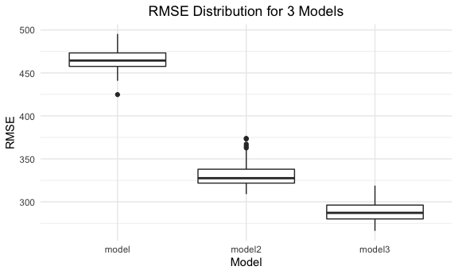

Homework 6
================
Philip Kim
11/29/2021

-   [Problem 1](#problem-1)
    -   [Load and tidy data](#load-and-tidy-data)
    -   [Regression Model](#regression-model)
    -   [Model comparison](#model-comparison)
        -   [Cross-Validation](#cross-validation)
-   [Problem 2](#problem-2)
    -   [R_hat_squared](#r_hat_squared)
        -   [Confidence Interval](#confidence-interval)
        -   [Distribution Plot](#distribution-plot)
    -   [Log(b0 \* b1)](#logb0--b1)
        -   [Confidence Interval](#confidence-interval-1)
        -   [Distribution Plot](#distribution-plot-1)

# Problem 1

## Load and tidy data

``` r
birthweight_df =
  read_csv("./data/birthweight.csv") %>% 
  janitor::clean_names() %>% 
  mutate(
    babysex = as.factor(babysex),
    frace = as.factor(frace),
    malform = as.factor(malform),
    mrace = as.factor(mrace))

sum(is.na(birthweight_df))
```

    ## [1] 0

## Regression Model

In efforts to propose a regression model for birthweight, I hypothesized
that the biological features of the mother, during the time of delivery,
were the most important factors. As such, the variables of interest were
`delwt`, `mheight`, `momage`, and `mrace`.

``` r
model = lm(bwt ~ delwt + mheight + momage + mrace, data = birthweight_df)

model %>% broom::tidy()
```

    ## # A tibble: 7 × 5
    ##   term        estimate std.error statistic  p.value
    ##   <chr>          <dbl>     <dbl>     <dbl>    <dbl>
    ## 1 (Intercept) 1610.      179.        8.97  4.34e-19
    ## 2 delwt          6.14      0.351    17.5   3.28e-66
    ## 3 mheight       11.6       3.00      3.87  1.12e- 4
    ## 4 momage         0.847     1.97      0.430 6.67e- 1
    ## 5 mrace2      -308.       15.6     -19.7   1.13e-82
    ## 6 mrace3        20.4      72.5       0.281 7.79e- 1
    ## 7 mrace4      -119.       32.5      -3.67  2.50e- 4

``` r
birthweight_df %>% 
  add_predictions(model) %>% 
  add_residuals(model) %>% 
  ggplot(aes(x = pred, y = resid)) +
  geom_point() +
  geom_smooth(se = FALSE) +
  labs(
    x = "Fitted Values",
    y = "Residuals",
    title = "Model Residuals against Fitted Values" ) +
   theme(plot.title = element_text(hjust = 0.5))
```


## Model comparison

``` r
model2 = lm(bwt ~ blength + gaweeks, data = birthweight_df)

model3 = lm(bwt ~ bhead + blength + babysex + bhead * blength + bhead * babysex + blength * babysex + bhead * blength * babysex, data = birthweight_df)
```

### Cross-Validation

``` r
cv_df = 
  crossv_mc(birthweight_df, 100) %>% 
  mutate(
    train = map(train, as_tibble),
    test = map(test, as_tibble))

cv_df = 
  cv_df %>% 
  mutate(
    model = map(train, ~lm(bwt ~ delwt + mheight + momage + mrace, data = .x)),
    model2 = map(train, ~lm(bwt ~ blength + gaweeks, data = .x)),
    model3 = map(train, ~lm(bwt ~ bhead * blength + bhead * babysex + blength * babysex + bhead * blength * babysex, data = .x))) %>% 
  mutate(
    rmse_model = map2_dbl(model, test, ~rmse(model = .x, data = .y)),
    rmse_model2 = map2_dbl(model2, test, ~rmse(model = .x, data = .y)),
    rmse_model3 = map2_dbl(model3, test, ~rmse(model = .x, data = .y)))

cv_df %>% 
  select(starts_with("rmse")) %>% 
  pivot_longer(
    everything(),
    names_to = "model",
    values_to = "rmse",
    names_prefix = "rmse_"
  ) %>% 
  ggplot(aes(x = model, y = rmse)) +
  geom_boxplot() +
  labs(
    x = "Model",
    y = "RMSE",
    title = "RMSE for 3 Models") +
  theme(plot.title = element_text(hjust = 0.5))
```



# Problem 2

``` r
set.seed(1)

weather_df = 
  rnoaa::meteo_pull_monitors(
    c("USW00094728"),
    var = c("PRCP", "TMIN", "TMAX"), 
    date_min = "2017-01-01",
    date_max = "2017-12-31") %>%
  mutate(
    name = recode(id, USW00094728 = "CentralPark_NY"),
    tmin = tmin / 10,
    tmax = tmax / 10) %>%
  select(name, id, everything())
```

## R_hat_squared

``` r
r_hat_squared = 
  weather_df %>% 
  bootstrap(n = 5000, id = "strap_number") %>% 
  mutate(
    models = map(.x = strap, ~ lm(tmax ~ tmin, data = .x)),
    results = map(models, broom::glance)
  ) %>% 
  select(strap_number, results) %>% 
  unnest(results)
```

### Confidence Interval

``` r
r_hat_squared %>% 
  summarize(
    lower = quantile(r.squared, 0.025),
    upper = quantile(r.squared, 0.975)) %>% 
  kable()
```

|     lower |    upper |
|----------:|---------:|
| 0.8936684 | 0.927106 |

### Distribution Plot

``` r
r_hat_squared %>% 
  ggplot(aes(x = r.squared)) + 
  geom_density() +
  labs(
    x = "R hat squared",
    y = "Density",
    title = "Distribution of R hat squared estimated values") +
  theme(plot.title = element_text(hjust = 0.5))
```


## Log(b0 \* b1)

``` r
log_b0_b1 = 
  weather_df %>% 
  bootstrap(n = 5000, id = "strap_number") %>% 
  mutate(
    models = map(.x = strap, ~ lm(tmax ~ tmin, data = .x)),
    results = map(models, broom::tidy)
  ) %>% 
  select(strap_number, results) %>% 
  unnest(results) %>% 
  select(strap_number:estimate) %>% 
  pivot_wider(
    names_from = "term",
    values_from = "estimate") %>% 
  janitor::clean_names() %>% 
  mutate(
    new_log = log(intercept * tmin)
    )
```

### Confidence Interval

``` r
log_b0_b1 %>% 
  summarize(
    lower = quantile(new_log, 0.025),
    upper = quantile(new_log, 0.975)) %>% 
  kable()
```

|    lower |    upper |
|---------:|---------:|
| 1.964811 | 2.058645 |

### Distribution Plot

``` r
log_b0_b1 %>% 
  ggplot(aes(x = new_log)) + 
  geom_density() +
  labs(
    x = "log(b0 * b1)",
    y = "Density",
    title = "Distribution of log(b0 *b1) estimated values") +
  theme(plot.title = element_text(hjust = 0.5))
```


